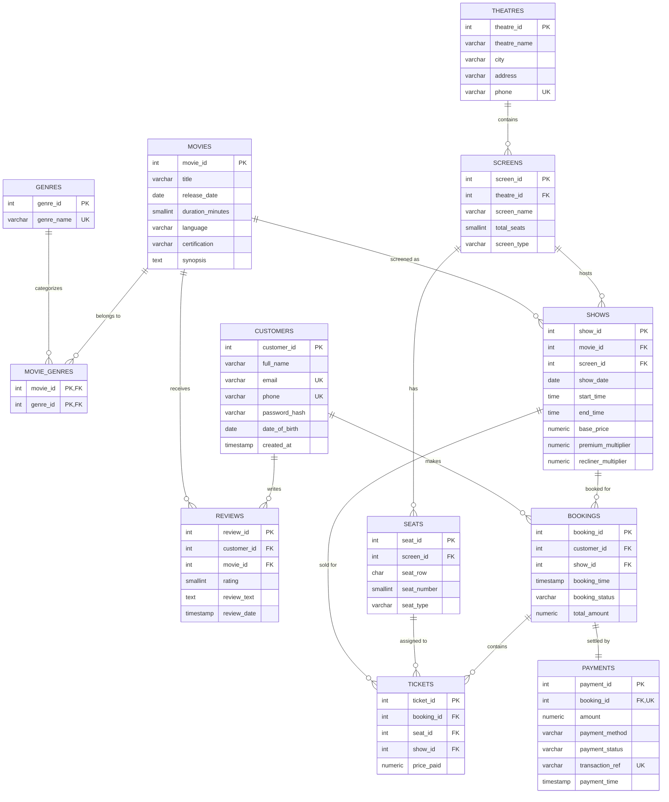
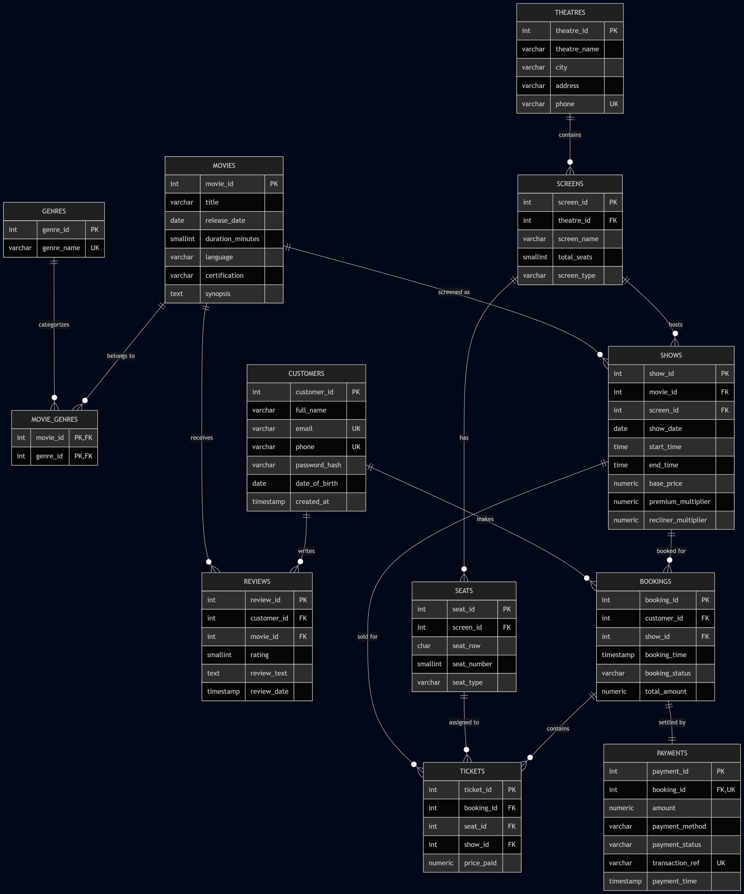

# 🎬 TicketHub — Movie Ticket Booking System (PostgreSQL Database Design)

A production-inspired relational database for a multi-theatre movie ticket booking platform, designed as a DBMS course project. Focuses purely on schema design, normalization, and SQL — no application layer.

## Overview

TicketHub models the full data lifecycle of a ticketing platform: theatres and screens, seat inventory, show scheduling, customer bookings, seat-level ticketing, payments, and reviews. The schema is normalized to **BCNF** and enforces referential integrity through primary/foreign keys, composite uniqueness constraints, and check constraints .

## Tech Stack

- **Database:** PostgreSQL
- **Scope:** DDL, DML (sample data), and analytical SQL only

## Schema (12 Tables)

| Table | Purpose |
|---|---|
| `genres` | Master list of movie genres |
| `movies` | Movie metadata |
| `movie_genres` | M:N junction — movies ↔ genres |
| `theatres` | Theatre branches |
| `screens` | Auditoriums within a theatre |
| `seats` | Seat layout per screen (Standard / Premium / Recliner) |
| `customers` | Registered users |
| `shows` | Movie-to-screen scheduling with pricing |
| `bookings` | Customer reservation header |
| `tickets` | Seat-level line items per booking |
| `payments` | 1:1 transaction record per booking |
| `reviews` | M:N junction with attributes — customers ↔ movies |

**Relationship mix:** 1:1 (`bookings`↔`payments`), 1:N (`theatres`→`screens`→`seats`, `movies`→`shows`, `customers`→`bookings`→`tickets`), M:N (`movie_genres`, `reviews`).

## Key Design Decisions

- **Composite uniqueness for data integrity**: `UNIQUE(show_id, seat_id)` on `tickets` makes double-selling a seat for the same show structurally impossible; `UNIQUE(customer_id, movie_id)` on `reviews` caps one review per customer per movie; `UNIQUE(screen_id, show_date, start_time)` on `shows` prevents scheduling conflicts on a screen.
- **Historical price integrity**: `tickets.price_paid` and `bookings.total_amount` are stored at transaction time rather than derived from `shows.base_price`, so later price changes never corrupt past records.
- **Strict CHECK constraints** enforce domain rules at the database layer (rating 1–5, seat/screen/certification enums, `end_time > start_time`, positive amounts).

## Repository Structure

```
.
├── ddl.sql                            # Schema: tables, keys, constraints
├── insert_data.sql                    # Realistic sample data (10-20+ rows/table)
├── queries.sql                        # 20 sql queries
├── schema.dbml                        # dbdiagram.io-ready ER schema
└── er_diagram_and_normalization.md    # ER diagram (Mermaid) + BCNF proof + design rationale
```

## Setup

```bash
psql -U postgres -d TicketHub -f ddl.sql
psql -U postgres -d TicketHub -f insert_data.sql
psql -U postgres -d TicketHub -f queries.sql
```

## Query Highlights

- Correlated subqueries identifying above-average-activity customers
- `EXISTS` / `NOT EXISTS` for scheduled-but-unreviewed movies and never-booked customers
- Multi-table joins reconstructing a full booking → payment → theatre trail


## ER Diagram





## Normalization Walkthrough

**1NF** — Every table stores atomic, single-valued attributes only (e.g., a customer's phone is one value, not a list; no repeating groups). Multi-valued associations — a movie having several genres, a customer reviewing several movies — are factored out into `movie_genres` and `reviews` rather than stored as comma-separated columns.

**2NF** — Every non-key attribute depends on the *whole* primary key, not part of it. This matters only for composite-key tables:
- `movie_genres (movie_id, genre_id)` has no non-key attributes at all, so partial dependency is impossible.
- All other tables use a single-column surrogate key (`SERIAL`), so 2NF is automatically satisfied.

**3NF** — No non-key attribute depends transitively on another non-key attribute.
- `shows` stores `base_price` directly against the show rather than deriving it through `screens` or `movies`, avoiding a transitive path.
- `tickets.price_paid` is stored as a historical fact (the price actually charged), not derived at query time from `shows.base_price`, since prices can change after a ticket is sold — this is intentional denormalization for auditability, not a normalization violation, because `price_paid` depends only on `ticket_id`.
- `bookings.total_amount` similarly records the amount agreed at booking time and depends only on `booking_id`.

**BCNF** — For every non-trivial functional dependency `X → Y`, `X` must be a superkey.
- `genres`, `movies`, `theatres`, `customers`: single candidate key (surrogate PK) plus one or two UNIQUE attributes (`genre_name`, `title+release_date`, `phone`, `email+phone`) that each independently determine the whole row — no attribute determines another non-key attribute, so BCNF holds trivially.
- `screens`: `screen_id` is the PK; `(theatre_id, screen_name)` is a candidate key (UNIQUE constraint) that also determines every other attribute. No other determinant exists → BCNF.
- `seats`: `seat_id` is the PK; `(screen_id, seat_row, seat_number)` is a candidate key. All FDs originate from a superkey → BCNF.
- `shows`: `show_id` is the PK; `(screen_id, show_date, start_time)` is a candidate key (a screen can't run two shows at once). All other attributes depend on this key → BCNF.
- `bookings`, `tickets`, `payments`, `reviews`: PK is the surrogate key; the additional UNIQUE constraints (`(show_id, seat_id)` on tickets, `booking_id` on payments, `(customer_id, movie_id)` on reviews) are themselves candidate keys, and no non-candidate-key attribute determines another attribute → BCNF.
- `movie_genres`: the composite PK `(movie_id, genre_id)` is the only key and there are no other attributes, so BCNF holds vacuously.

No table exhibits a determinant that is not a candidate key, so **every table in this schema is in BCNF**.

## Design Rationale

- **Separation of `seats` from `tickets`**: `seats` is static inventory (the physical layout of a screen); `tickets` is a transactional fact (a seat sold for one specific show). Merging them would force re-inserting seat rows per show and violate 3NF by duplicating row/number/type data.
- **`tickets` vs `bookings`**: a `booking` is the customer-facing transaction (one row per checkout); `tickets` breaks it down per seat, enabling group bookings and clean seat-level uniqueness (`UNIQUE(show_id, seat_id)`) without polluting `bookings` with a variable number of seat columns.
- **`payments` as a separate 1:1 table** (rather than columns on `bookings`) isolates transactional/financial state (status, gateway reference) from booking state, mirroring how real payment gateways reconcile asynchronously.
- **`movie_genres` and `reviews` as junction tables** correctly model the two independent M:N relationships in the domain without redundant repetition of movie or customer data.
